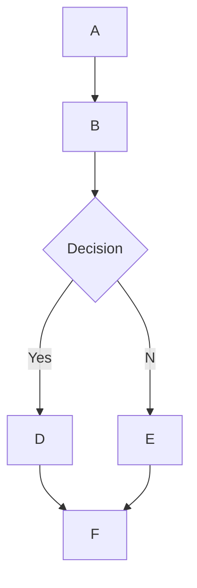

# 🌊 Open WebUI 的 MermaidJS 图表功能

## 概述

Open WebUI 支持在聊天界面中直接生成和显示 MermaidJS 图表，包括流程图、饼图等可视化内容。MermaidJS 是一款强大的可视化工具，能够将复杂的信息和想法转化为直观的图表。当与大语言模型结合使用时，它能够帮助我们更好地生成和探索新的想法。

## 使用 MermaidJS

要创建 MermaidJS 图表，只需在聊天中让大语言模型帮您绘制图表即可。以下是一些示例提示语：

* "请用 Mermaid 画一个简单的决策流程图，并解释它的工作原理。"
* "用 Mermaid 绘制一个决策树，用来判断今天是否适合出门散步。"

请注意，为了确保正确显示，模型生成的代码必须以 `mermaid` 关键字开头，然后才是具体的图表代码。您可以参考 [MermaidJS 官方文档](https://mermaid.js.org/intro/) 了解正确的语法规则，这样可以更好地引导模型生成符合要求的代码。

## 图表的显示

当您请求生成图表时，大语言模型会生成相应的 MermaidJS 代码。只要代码语法正确，Open WebUI 就会自动将其转换为可视化图表。

如果模型生成了代码但没有显示图表，通常是因为代码中存在语法错误。不用担心，系统会在生成完成后提示具体的错误信息。遇到这种情况时，您可以参考 [MermaidJS 文档](https://mermaid.js.org/intro/) 找出问题所在，然后调整您的提示语。

## 图表交互功能

当图表显示后，您可以：

* 使用缩放功能查看细节
* 点击右上角的复制图标获取原始的 MermaidJS 代码

### 示例



上述代码会生成如下流程图：

```markdown
 startAncestor [ start ]
A[A] --> B[B]
B --> C[Decision]
C -->| Yes | D[D]
C -->| No  | E[E]
D --> F[F]
E --> F[F]
```

要充分利用 MermaidJS 的功能，建议您多尝试不同类型的图表。如果使用较小的模型，可以参考 [MermaidJS 文档](https://mermaid.js.org/intro/) 来指导模型，或者让模型先总结文档要点，制作成系统提示词。通过实践和探索，您一定能够掌握这个强大的可视化工具，充分发挥它在 Open WebUI 中的作用。
