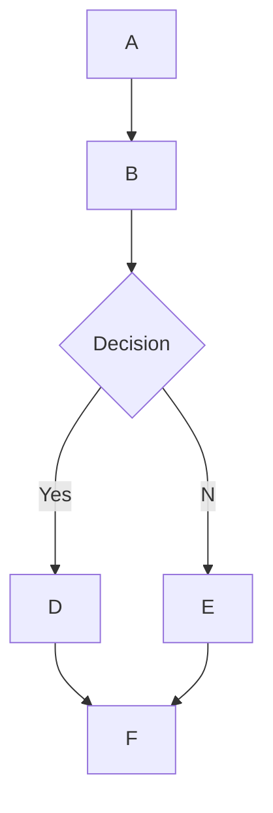

# 🌊 Open WebUI 中的 MermaidJS 渲染支持

## 概述

Open WebUI 支持在聊天界面中直接渲染视觉效果优美的 MermaidJS 图表、流程图、饼图等。MermaidJS 是一个用于可视化复杂信息和想法的强大工具，当与大型语言模型（LLM）的功能结合时，它可以成为生成和探索新想法的有力工具。

## 在 Open WebUI 中使用 MermaidJS

要生成 MermaidJS 图表，只需在任何聊天中要求 LLM 使用 MermaidJS 创建图表或流程图。例如，您可以要求 LLM：

* "使用 Mermaid 为我创建一个简单的决策过程流程图。解释流程图是如何工作的。"
* "使用 Mermaid 可视化一个决策树，用于判断是否适合外出散步。"

请注意，为了正确渲染 LLM 的响应，它必须以单词 `mermaid` 开头，后跟 MermaidJS 代码。您可以参考 [MermaidJS 文档](https://mermaid.js.org/intro/) 以确保语法正确，并为 LLM 提供结构化的提示，以引导它生成更好的 MermaidJS 语法。

## 在聊天中直接可视化 MermaidJS 代码

当您请求 MermaidJS 可视化时，大型语言模型（LLM）将生成必要的代码。只要代码使用有效的 MermaidJS 语法，Open WebUI 就会自动在聊天界面中直接渲染可视化效果。

如果模型生成了 MermaidJS 语法，但可视化效果没有渲染，通常表示代码中存在语法错误。不用担心 - 一旦响应完全生成，您就会收到任何错误的通知。如果发生这种情况，请尝试参考 [MermaidJS 文档](https://mermaid.js.org/intro/) 来识别问题并相应地修改提示。

## 与可视化交互

一旦显示了可视化效果，您可以：

* 放大和缩小以更仔细地查看。
* 通过点击显示区域右上角的复制按钮来复制用于生成可视化的原始 MermaidJS 代码。

### 示例



这将生成如下流程图：

```markdown
 startAncestor [ start ]
A[A] --> B[B]
B --> C[Decision]
C -->| Yes | D[D]
C -->| No  | E[E]
D --> F[F]
E --> F[F]
```

尝试不同类型的图表可以帮助您更深入地理解如何在 Open WebUI 中有效利用 MermaidJS。对于较小的模型，请考虑参考 [MermaidJS 文档](https://mermaid.js.org/intro/) 为 LLM 提供指导，或让它将文档总结为全面的笔记或系统提示。通过遵循这些指南并探索 MermaidJS 的功能，您可以充分发挥这个强大工具在 Open WebUI 中的潜力。
