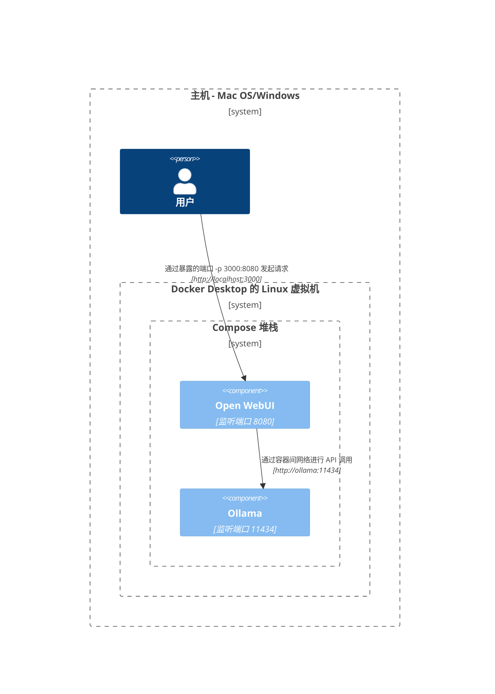
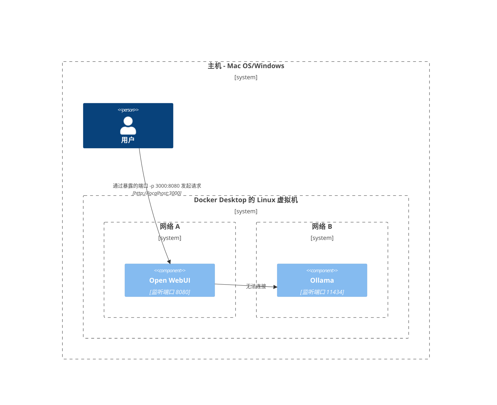
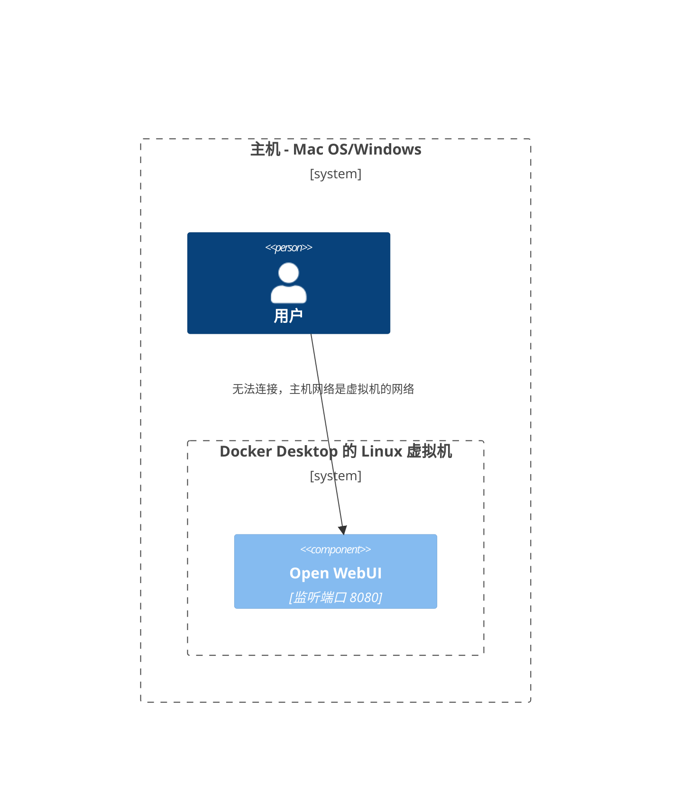
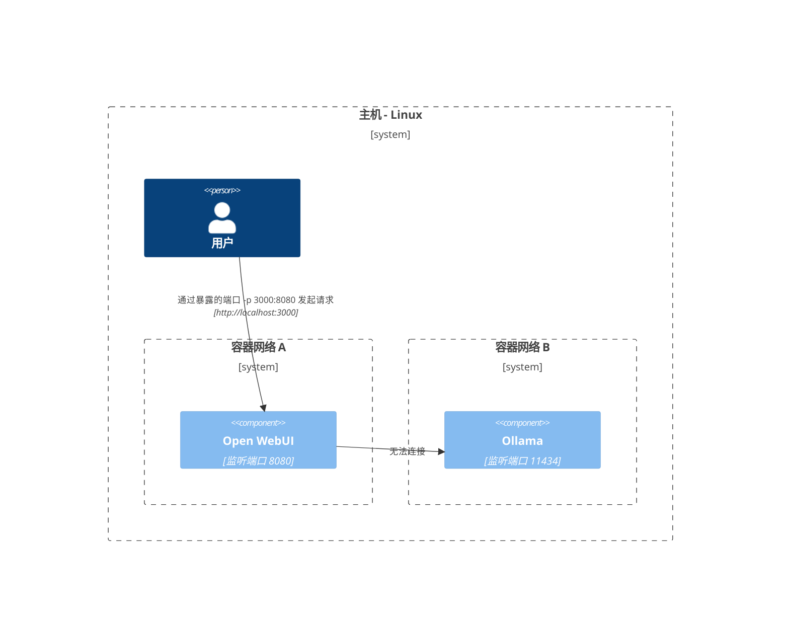

在这里，我们提供清晰和结构化的图表，帮助你理解不同设置中各个网络组件之间的交互方式。本文档旨在帮助 macOS/Windows 和 Linux 用户。每个场景都使用 Mermaid 图表来展示根据不同的系统配置和部署策略如何设置交互。

## Mac OS/Windows 设置选项 🖥️

### Ollama 在主机上，Open WebUI 在容器中

在这种场景中，`Ollama` 直接在主机上运行，而 `Open WebUI` 在 Docker 容器中运行。

### Ollama 和 Open WebUI 在 Compose 堆栈中

`Ollama` 和 `Open WebUI` 都配置在同一个 Docker Compose 堆栈中，简化了网络通信。

### Ollama 和 Open WebUI，独立网络

在这里，`Ollama` 和 `Open WebUI` 部署在独立的 Docker 网络中，可能会导致连接问题。

### Open WebUI 在主机网络中

在这种配置中，`Open WebUI` 使用主机网络，这会影响其在某些环境中的连接能力。

## Linux 设置选项 🐧

### Ollama 在主机上，Open WebUI 在容器中（Linux）

这个图表专门针对 Linux 平台，`Ollama` 在主机上运行，`Open WebUI` 部署在 Docker 容器中。

### Ollama 和 Open WebUI 在 Compose 堆栈中（Linux）

一个设置，其中 `Ollama` 和 `Open WebUI` 都位于同一个 Docker Compose 堆栈中，在 Linux 上实现简单的网络连接。

### Ollama 和 Open WebUI，独立网络（Linux）

一个场景，其中 `Ollama` 和 `Open WebUI` 在 Linux 环境下位于不同的 Docker 网络中，这可能会阻碍连接。

### Open WebUI 在主机网络中，Ollama 在主机上（Linux）

一个最优布局，其中 `Open WebUI` 和 `Ollama` 都使用主机的网络，在 Linux 系统上实现无缝交互。

每种设置都针对不同的部署策略和网络配置，帮助你选择最适合你需求的布局。
