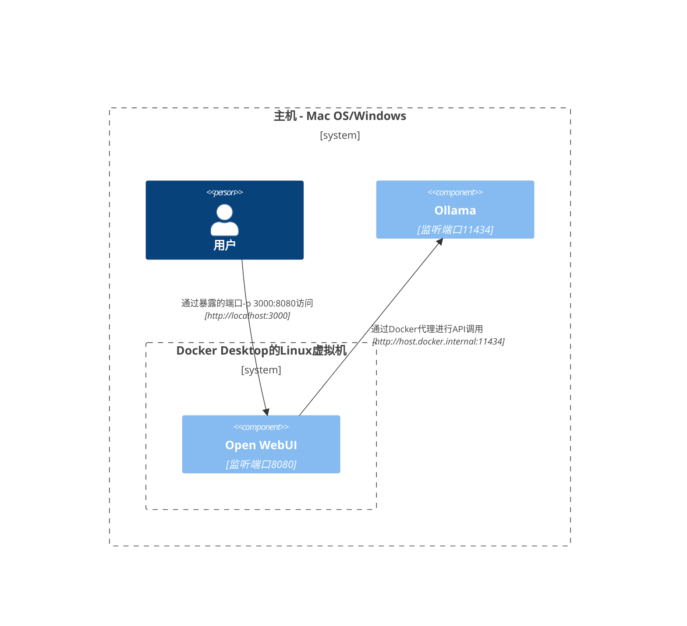
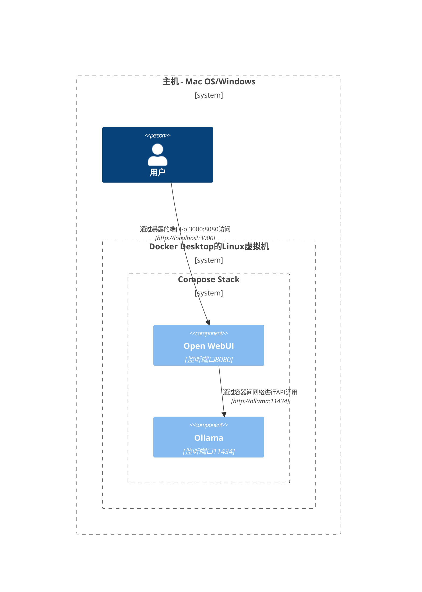
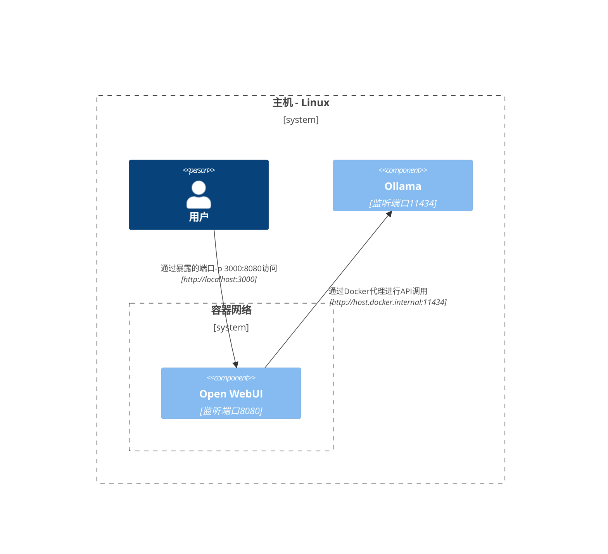
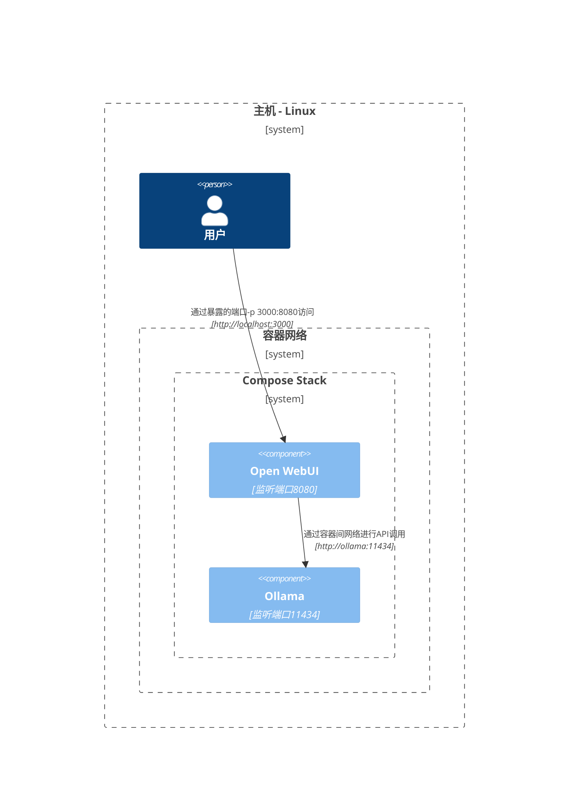
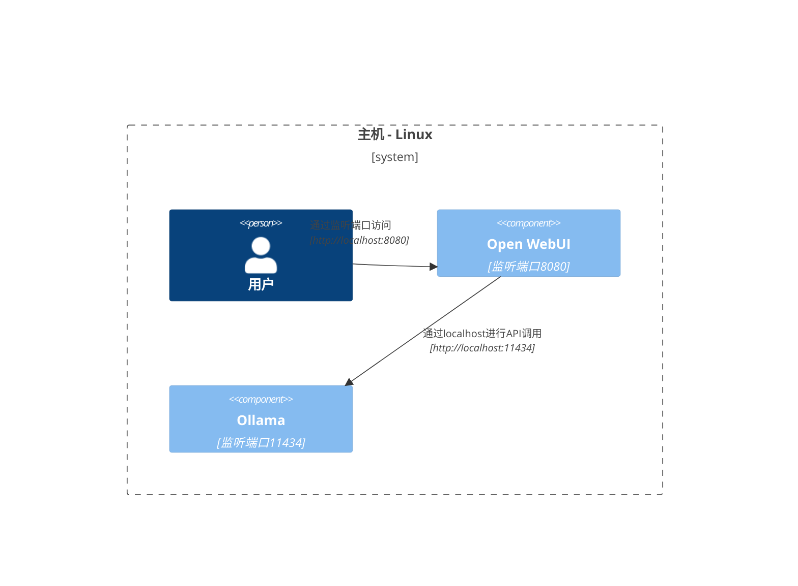

本文提供清晰且结构化的网络架构图，帮助你理解不同部署场景中各组件之间的网络交互方式。我们针对macOS/Windows和Linux用户分别进行说明，并使用Mermaid图表直观展示不同系统配置和部署策略下的网络连接关系。

## Mac OS/Windows部署方案 🖥️

### 方案一：Ollama运行于主机，Open WebUI运行于容器

在这种配置中，`Ollama`直接在主机系统上运行，而`Open WebUI`运行在Docker容器内。

### 方案二：Ollama和Open WebUI运行于同一Docker Compose Stack

这种配置将`Ollama`和`Open WebUI`都部署在同一个Docker Compose stack中，简化了组件间的网络通信。

### 方案三：Ollama和Open WebUI运行于不同Docker网络

此配置中，`Ollama`和`Open WebUI`分别部署在不同的Docker网络中，这种情况可能会导致连接问题。

### 方案四：Open WebUI使用host网络模式

在这种配置下，`Open WebUI`使用Docker的host网络模式，但这可能会影响其在某些环境中的连接能力。

## Linux部署方案 🐧

### 方案一：Ollama运行于主机，Open WebUI运行于容器（Linux）

这种部署方案专门针对Linux平台，其中`Ollama`运行在主机系统上，而`Open WebUI`运行在Docker容器中。

### 方案二：Ollama和Open WebUI运行于同一Docker Compose Stack（Linux）

这种配置将`Ollama`和`Open WebUI`都部署在同一个Docker Compose stack中，在Linux环境下实现简单高效的网络通信。

### 方案三：Ollama和Open WebUI运行于不同Docker网络（Linux）

在这种配置中，`Ollama`和`Open WebUI`在Linux环境下分别部署在不同的Docker网络中，这种情况可能会导致连接问题。

### 方案四：Open WebUI和Ollama都使用host网络模式（Linux）

这是Linux环境下的最优配置方案，`Open WebUI`和`Ollama`都使用主机网络模式，可以实现最简单和最高效的网络通信。

以上每种部署方案都针对特定的使用场景和网络需求，你可以根据自己的具体情况选择最适合的配置方案。
