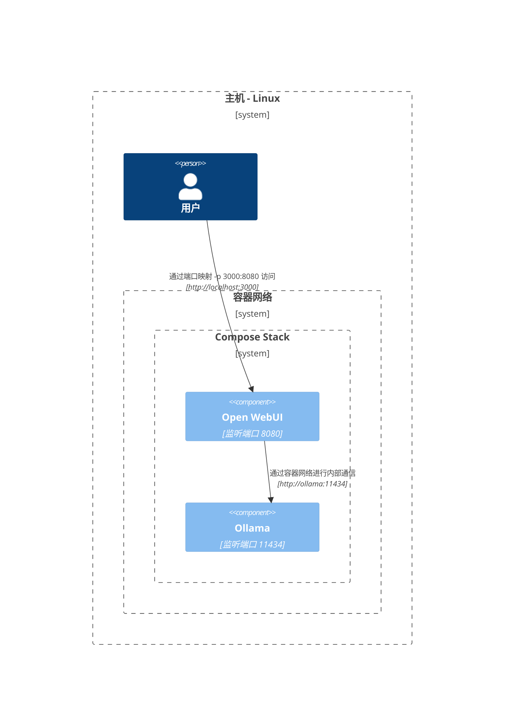
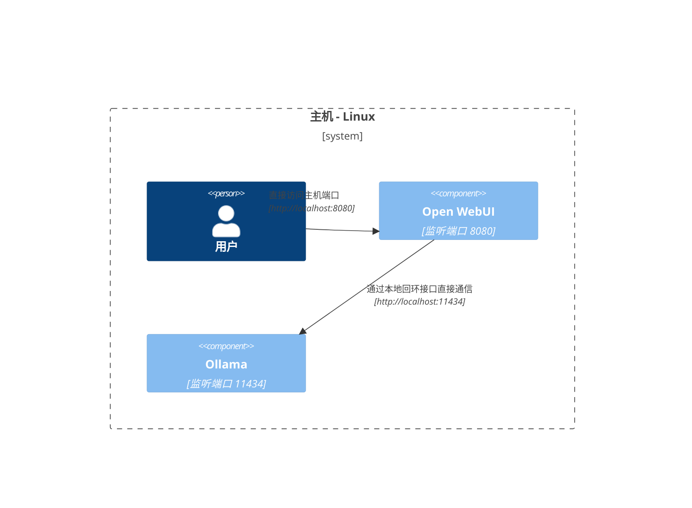

本文通过详细的网络架构图解，帮助你深入理解不同部署场景下系统组件间的网络通信机制。文档面向 macOS/Windows 和 Linux 用户，采用 Mermaid 图表技术，直观展示各种系统配置和部署策略下的组件交互关系。

## macOS/Windows 部署架构 🖥️

### 架构一：主机 Ollama + 容器化 Open WebUI

在此架构中，`Ollama` 服务运行于主机系统，而 `Open WebUI` 运行在 Docker 容器环境中。

### 架构二：Docker Compose 统一编排

采用 Docker Compose Stack 统一编排 `Ollama` 和 `Open WebUI` 服务，实现容器间的高效网络通信。

### 架构三：独立网络部署（不建议使用）

此架构将 `Ollama` 和 `Open WebUI` 部署在独立的 Docker 网络中，可能导致跨网络通信障碍。

### 架构四：主机网络模式（macOS/Windows 不适用）

此架构尝试在容器中使用主机网络模式，但由于 macOS/Windows 的虚拟化特性，该模式无法正常工作。

## Linux 部署架构 🐧

### 架构一：混合部署模式

专为 Linux 平台优化的部署方案，`Ollama` 运行于主机系统，`Open WebUI` 运行在 Docker 容器中。

### 架构二：Docker Compose 统一编排（Linux）

在 Linux 环境中使用 Docker Compose Stack 统一编排服务，确保容器间的高效网络通信。

### 架构三：独立网络部署（Linux 环境不建议）

在 Linux 环境中将服务部署在独立的 Docker 网络中，可能引发网络通信问题。

### 架构四：主机网络模式（Linux 推荐方案）

Linux 环境下的最优部署方案，通过主机网络模式实现最简单直接的网络通信。

以上部署架构方案各具特点，适用于不同的运行环境和网络需求。建议根据你的具体部署环境、安全要求和性能需求，选择最适合的架构方案。在选择时，需要考虑网络性能、安全性、维护难度等多个因素。
