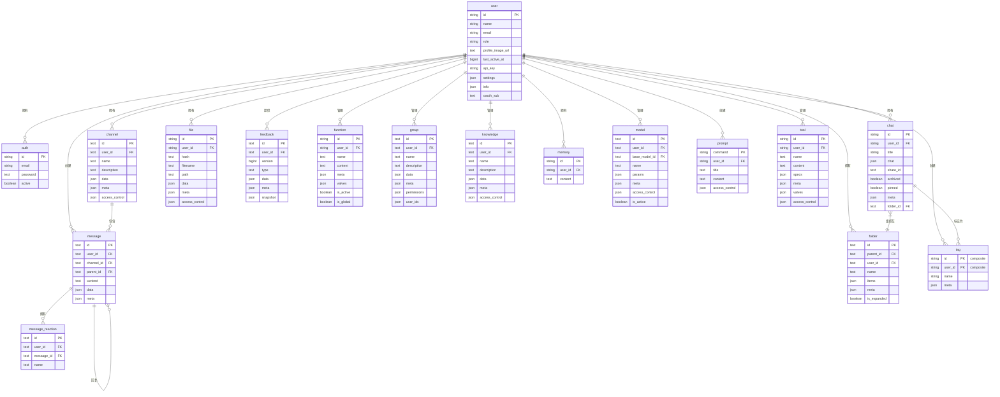

:::warning
本教程是社区贡献的内容，不受 Open WebUI 团队支持。它仅作为如何为您的特定用例自定义 Open WebUI 的演示。想要贡献？请查看贡献教程。
:::

> [!WARNING]  
> 本文档是基于当前版本（0.5.11）创建的，并在不断更新中。

# Open-WebUI 内部 SQLite 数据库

对于 Open-WebUI，SQLite 数据库是用户管理、聊天记录、文件存储及其他各种核心功能的支柱。了解这一结构对于任何希望有效贡献或维护项目的人来说都是至关重要的。

## 内部 SQLite 位置

您可以在 `root` -> `data` -> `webui.db` 找到 SQLite 数据库

```
📁 Root (/)
├── 📁 data
│   ├── 📁 cache
│   ├── 📁 uploads
│   ├── 📁 vector_db
│   └── 📄 webui.db
├── 📄 dev.sh
├── 📁 open_webui
├── 📄 requirements.txt
├── 📄 start.sh
└── 📄 start_windows.bat
```

## 本地复制数据库

如果您想将运行在容器中的 Open-WebUI SQLite 数据库复制到本地计算机，可以使用：

```bash
docker cp open-webui:/app/backend/data/webui.db ./webui.db
```

或者，您可以使用以下命令在容器内访问数据库：

```bash
docker exec -it open-webui /bin/sh
```

## 表概述

以下是 Open-WebUI 的 SQLite 数据库中表的完整列表。表按字母顺序排列并编号以方便查找。

| **编号** | **表名**         | **描述**                                                  |
| ------- | ---------------- | -------------------------------------------------------- |
| 01      | auth             | 存储用户认证凭据和登录信息                               |
| 02      | channel          | 管理聊天频道及其配置                                     |
| 03      | channel_member   | 跟踪用户在频道中的成员资格和权限                         |
| 04      | chat             | 存储聊天会话及其元数据                                   |
| 05      | chatidtag        | 映射聊天与其关联标签之间的关系                           |
| 06      | config           | 维护系统范围的配置设置                                   |
| 07      | document         | 存储文档及其元数据以进行知识管理                         |
| 08      | feedback         | 捕获用户反馈和评分                                       |
| 09      | file             | 管理上传的文件及其元数据                                 |
| 10      | folder           | 将文件和内容组织成层次结构                               |
| 11      | function         | 存储自定义函数及其配置                                   |
| 12      | group            | 管理用户组及其权限                                       |
| 13      | knowledge        | 存储知识库条目及相关信息                                 |
| 14      | memory           | 维护聊天记录和上下文记忆                                 |
| 15      | message          | 存储单个聊天消息及其内容                                 |
| 16      | message_reaction | 记录用户对消息的反应（表情/回复）                        |
| 17      | migrate_history  | 跟踪数据库模式版本和迁移记录                             |
| 18      | model            | 管理 AI 模型配置和设置                                   |
| 19      | prompt           | 存储 AI 提示词的模板和配置                               |
| 20      | tag              | 管理内容分类的标签/标记                                  |
| 21      | tool             | 存储系统工具和集成的配置                                 |
| 22      | user             | 维护用户资料和账户信息                                   |

注意：Open-WebUI 的 SQLite 数据库中有两个与核心功能无关的附加表，已被排除：

- Alembic 版本表
- 迁移历史表

现在我们已经列出了所有的表，接下来让我们了解每个表的结构。

## Auth 表

| **列名**       | **数据类型** | **约束**       | **描述**         |
| --------------- | ------------- | --------------- | ----------------- |
| id              | String        | PRIMARY KEY     | 唯一标识符       |
| email           | String        | -               | 用户的电子邮件   |
| password        | Text          | -               | 哈希密码         |
| active          | Boolean       | -               | 账户状态         |

关于 auth 表需要了解的事项：

- 使用 UUID 作为主键
- 与 `users` 表一对一关系（共享 id）

## Channel 表

| **列名**       | **数据类型** | **约束**       | **描述**                             |
| --------------- | ------------- | --------------- | ----------------------------------- |
| id              | Text          | PRIMARY KEY     | 唯一标识符（UUID）                  |
| user_id         | Text          | -               | 频道的所有者/创建者                 |
| type            | Text          | nullable        | 频道类型                            |
| name            | Text          | -               | 频道名称                            |
| description     | Text          | nullable        | 频道描述                            |
| data            | JSON          | nullable        | 灵活的数据存储                      |
| meta            | JSON          | nullable        | 频道元数据                          |
| access_control  | JSON          | nullable        | 权限设置                            |
| created_at      | BigInteger    | -               | 创建时间戳（纳秒）                  |
| updated_at      | BigInteger    | -               | 最后更新时间戳（纳秒）              |

关于 auth 表需要了解的事项：

- 使用 UUID 作为主键
- 频道名称不区分大小写（存储为小写）

## Channel Member 表

| **列名**       | **数据类型** | **约束**       | **描述**                                      |
| --------------- | ------------- | --------------- | -------------------------------------------- |
| id              | TEXT          | NOT NULL        | 频道成员资格的唯一标识符                     |
| channel_id      | TEXT          | NOT NULL        | 频道的引用                                   |
| user_id         | TEXT          | NOT NULL        | 用户的引用                                   |
| created_at      | BIGINT        | -               | 成员资格创建的时间戳                         |

## Chat 表

| **列名**       | **数据类型** | **约束**         | **描述**                  |
| --------------- | ------------- | ----------------------- | ------------------------ |
| id              | String        | PRIMARY KEY             | 唯一标识符（UUID）       |
| user_id         | String        | -                       | 聊天的所有者             |
| title           | Text          | -                       | 聊天标题                 |
| chat            | JSON          | -                       | 聊天内容和历史           |
| created_at      | BigInteger    | -                       | 创建时间戳               |
| updated_at      | BigInteger    | -                       | 最后更新时间戳           |
| share_id        | Text          | UNIQUE, nullable        | 共享标识符               |
| archived        | Boolean       | default=False           | 存档状态                 |
| pinned          | Boolean       | default=False, nullable | 置顶状态                 |
| meta            | JSON          | server_default="{}"     | 包含标签的元数据         |
| folder_id       | Text          | nullable                | 父文件夹 ID              |

## Chat ID Tag 表

| **列名**       | **数据类型** | **约束**       | **描述**            |
| --------------- | ------------- | --------------- | ------------------ |
| id              | VARCHAR(255)  | NOT NULL        | 唯一标识符         |
| tag_name        | VARCHAR(255)  | NOT NULL        | 标签名称           |
| chat_id         | VARCHAR(255)  | NOT NULL        | 聊天的引用         |
| user_id         | VARCHAR(255)  | NOT NULL        | 用户的引用         |
| timestamp       | INTEGER       | NOT NULL        | 创建时间戳         |

## 配置

| **列名**       | **数据类型** | **约束**       | **默认值**         | **描述**              |
| --------------- | ------------- | --------------- | ----------------- | ---------------------- |
| id              | INTEGER       | NOT NULL        | -                 | 主键标识符            |
| data            | JSON          | NOT NULL        | -                 | 配置数据              |
| version         | INTEGER       | NOT NULL        | -                 | 配置版本号            |
| created_at      | DATETIME      | NOT NULL        | CURRENT_TIMESTAMP | 创建时间戳            |
| updated_at      | DATETIME      | -               | CURRENT_TIMESTAMP | 最后更新时间戳        |

## 反馈表

| **列名**       | **数据类型** | **约束**       | **描述**                     |
| --------------- | ------------- | --------------- | ------------------------------- |
| id              | Text          | PRIMARY KEY     | 唯一标识符（UUID）            |
| user_id         | Text          | -               | 提供反馈的用户                |
| version         | BigInteger    | default=0       | 反馈版本号                    |
| type            | Text          | -               | 反馈类型                      |
| data            | JSON          | nullable        | 包含评分的反馈数据            |
| meta            | JSON          | nullable        | 元数据（arena, chat_id 等）  |
| snapshot        | JSON          | nullable        | 关联的聊天快照                |
| created_at      | BigInteger    | -               | 创建时间戳                    |
| updated_at      | BigInteger    | -               | 最后更新时间戳                |

# 文件表

| **列名**       | **数据类型** | **约束**       | **描述**           |
| --------------- | ------------- | --------------- | --------------------- |
| id              | String        | PRIMARY KEY     | 唯一标识符         |
| user_id         | String        | -               | 文件的所有者       |
| hash            | Text          | nullable        | 文件哈希/校验和    |
| filename        | Text          | -               | 文件名             |
| path            | Text          | nullable        | 文件系统路径       |
| data            | JSON          | nullable        | 文件相关数据       |
| meta            | JSON          | nullable        | 文件元数据         |
| access_control  | JSON          | nullable        | 权限设置           |
| created_at      | BigInteger    | -               | 创建时间戳         |
| updated_at      | BigInteger    | -               | 最后更新时间戳     |

`meta` 字段的预期结构：

```python
{
    "name": string,          # 可选的显示名称
    "content_type": string,  # MIME 类型
    "size": integer,         # 文件大小（字节）
    # 通过 ConfigDict(extra="allow") 支持的附加元数据
}
```

## 文件夹表

| **列名**       | **数据类型** | **约束**       | **描述**                    |
| --------------- | ------------- | --------------- | ------------------------------ |
| id              | Text          | PRIMARY KEY     | 唯一标识符（UUID）           |
| parent_id       | Text          | nullable        | 层次结构的父文件夹 ID        |
| user_id         | Text          | -               | 文件夹的所有者               |
| name            | Text          | -               | 文件夹名称                   |
| items           | JSON          | nullable        | 文件夹内容                   |
| meta            | JSON          | nullable        | 文件夹元数据                 |
| is_expanded     | Boolean       | default=False   | UI 展开状态                  |
| created_at      | BigInteger    | -               | 创建时间戳                   |
| updated_at      | BigInteger    | -               | 最后更新时间戳               |

关于文件夹表需要了解的事项：

- 文件夹可以嵌套（parent_id 引用）
- 根文件夹的 parent_id 为 null
- 文件夹名称在同一父级内必须唯一

## 函数表

| **列名**       | **数据类型** | **约束**       | **描述**               |
| --------------- | ------------- | --------------- | ------------------------- |
| id              | String        | PRIMARY KEY     | 唯一标识符             |
| user_id         | String        | -               | 函数的所有者           |
| name            | Text          | -               | 函数名称               |
| type            | Text          | -               | 函数类型               |
| content         | Text          | -               | 函数内容/代码          |
| meta            | JSON          | -               | 函数元数据             |
| valves          | JSON          | -               | 函数控制设置           |
| is_active       | Boolean       | -               | 函数激活状态           |
| is_global       | Boolean       | -               | 全局可用性标志         |
| created_at      | BigInteger    | -               | 创建时间戳             |
| updated_at      | BigInteger    | -               | 最后更新时间戳         |

关于文件夹表需要了解的事项：

- `type` 只能是： ["filter", "action"]

## 组表

| **列名**       | **数据类型** | **约束**       | **描述**              |
| --------------- | ------------- | ------------------- | ------------------------ |
| id              | Text          | PRIMARY KEY, UNIQUE | 唯一标识符（UUID）     |
| user_id         | Text          | -                   | 组的所有者/创建者      |
| name            | Text          | -                   | 组名称                 |
| description     | Text          | -                   | 组描述                 |
| data            | JSON          | nullable            | 附加组数据             |
| meta            | JSON          | nullable            | 组元数据               |
| permissions     | JSON          | nullable            | 权限配置               |
| user_ids        | JSON          | nullable            | 成员用户 ID 列表       |
| created_at      | BigInteger    | -                   | 创建时间戳             |
| updated_at      | BigInteger    | -                   | 最后更新时间戳         |

## 知识表

| **列名**       | **数据类型** | **约束**       | **描述**                |
| --------------- | ------------- | ------------------- | -------------------------- |
| id              | Text          | PRIMARY KEY, UNIQUE | 唯一标识符（UUID）       |
| user_id         | Text          | -                   | 知识库的所有者           |
| name            | Text          | -                   | 知识库名称               |
| description     | Text          | -                   | 知识库描述               |
| data            | JSON          | nullable            | 知识库内容               |
| meta            | JSON          | nullable            | 附加元数据               |
| access_control  | JSON          | nullable            | 访问控制规则             |
| created_at      | BigInteger    | -                   | 创建时间戳               |
| updated_at      | BigInteger    | -                   | 最后更新时间戳           |

`access_control` 字段的预期结构：

```python
{
  "read": {
    "group_ids": ["group_id1", "group_id2"],
    "user_ids": ["user_id1", "user_id2"]
  },
  "write": {
    "group_ids": ["group_id1", "group_id2"],
    "user_ids": ["user_id1", "user_id2"]
  }
}
```

## 记忆表

| **列名**       | **数据类型** | **约束**       | **描述**              |
| --------------- | ------------- | --------------- | ------------------------ |
| id              | String        | PRIMARY KEY     | 唯一标识符（UUID）     |
| user_id         | String        | -               | 记忆的所有者           |
| content         | Text          | -               | 记忆内容               |
| created_at      | BigInteger    | -               | 创建时间戳             |
| updated_at      | BigInteger    | -               | 最后更新时间戳         |

## 消息表

| **列名**       | **数据类型** | **约束**       | **描述**                         |
| --------------- | ------------- | --------------- | ----------------------------------- |
| id              | Text          | PRIMARY KEY     | 唯一标识符（UUID）                |
| user_id         | Text          | -               | 消息作者                          |
| channel_id      | Text          | nullable        | 关联的频道                        |
| parent_id       | Text          | nullable        | 线程的父消息                      |
| content         | Text          | -               | 消息内容                          |
| data            | JSON          | nullable        | 附加消息数据                      |
| meta            | JSON          | nullable        | 消息元数据                        |
| created_at      | BigInteger    | -               | 创建时间戳（纳秒）                |
| updated_at      | BigInteger    | -               | 最后更新时间戳（纳秒）            |

## 消息反应表

| **列名**       | **数据类型** | **约束**       | **描述**              |
| --------------- | ------------- | --------------- | ------------------------ |
| id              | Text          | PRIMARY KEY     | 唯一标识符（UUID）     |
| user_id         | Text          | -               | 反应的用户             |
| message_id      | Text          | -               | 关联的消息             |
| name            | Text          | -               | 反应名称/表情          |
| created_at      | BigInteger    | -               | 反应时间戳             |

## 模型表

| **列名**       | **数据类型** | **约束**       | **描述**              |
| --------------- | ------------- | --------------- | ---------------------- |
| id              | Text          | PRIMARY KEY     | 模型标识符            |
| user_id         | Text          | -               | 模型的所有者          |
| base_model_id   | Text          | nullable        | 父模型引用            |
| name            | Text          | -               | 显示名称              |
| params          | JSON          | -               | 模型参数              |
| meta            | JSON          | -               | 模型元数据            |
| access_control  | JSON          | nullable        | 访问权限              |
| is_active       | Boolean       | default=True    | 激活状态              |
| created_at      | BigInteger    | -               | 创建时间戳            |
| updated_at      | BigInteger    | -               | 最后更新时间戳        |

## 提示词表

| **列名**       | **数据类型** | **约束**       | **描述**               |
| --------------- | ------------- | --------------- | ------------------------- |
| command         | String        | PRIMARY KEY     | 唯一命令标识符         |
| user_id         | String        | -               | 提示词的所有者         |
| title           | Text          | -               | 提示词标题             |
| content         | Text          | -               | 提示词内容/模板        |
| timestamp       | BigInteger    | -               | 最后更新时间戳         |
| access_control  | JSON          | nullable        | 访问权限               |

## 标签表

| **列名**       | **数据类型** | **约束**       | **描述**               |
| --------------- | ------------- | --------------- | ------------------------- |
| id              | String        | PK (composite)  | 规范化标签标识符       |
| name            | String        | -               | 显示名称               |
| user_id         | String        | PK (composite)  | 标签的所有者           |
| meta            | JSON          | nullable        | 标签元数据             |

关于标签表需要了解的事项：

- 主键是复合的（id, user_id）

## 工具表

| **列名**       | **数据类型** | **约束**       | **描述**           |
| --------------- | ------------- | --------------- | --------------------- |
| id              | String        | PRIMARY KEY     | 唯一标识符         |
| user_id         | String        | -               | 工具的所有者       |
| name            | Text          | -               | 工具名称           |
| content         | Text          | -               | 工具内容/代码      |
| specs           | JSON          | -               | 工具规格           |
| meta            | JSON          | -               | 工具元数据         |
| valves          | JSON          | -               | 工具控制设置       |
| access_control  | JSON          | nullable        | 访问权限           |
| created_at      | BigInteger    | -               | 创建时间戳         |
| updated_at      | BigInteger    | -               | 最后更新时间戳     |

## 用户表

| **列名**       | **数据类型** | **约束**       | **描述**              |
| --------------- | ------------- | ---------------- | ------------------------ |
| id              | String        | PRIMARY KEY      | 唯一标识符            |
| name            | String        | -                | 用户名                |
| email           | String        | -                | 用户的电子邮件        |
| role            | String        | -                | 用户角色              |
| profile_image_url | Text        | -                | 个人资料图片路径      |
| last_active_at  | BigInteger    | -                | 最后活动时间戳        |
| updated_at      | BigInteger    | -                | 最后更新时间戳        |
| created_at      | BigInteger    | -                | 创建时间戳            |
| api_key         | String        | UNIQUE, nullable | API 认证密钥          |
| settings        | JSON          | nullable         | 用户偏好设置          |
| info            | JSON          | nullable         | 附加用户信息          |
| oauth_sub       | Text          | UNIQUE           | OAuth 主体标识符      |

# 实体关系图

为了帮助可视化表之间的关系，请参考下面使用 Mermaid 生成的实体关系图（ERD）。


